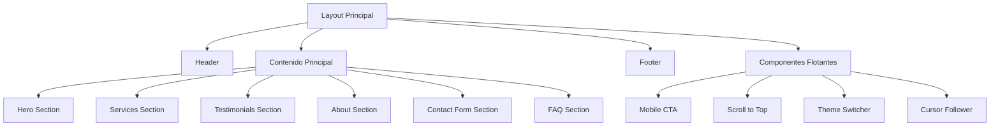

# 🚀 Zanovix AI - Sitio Web Corporativo

<div align="center">
  
  
  [](https://nextjs.org/)
  [](https://www.typescriptlang.org/)
  [](https://tailwindcss.com/)
  [](https://www.framer.com/motion/)
  
  **Sitio web moderno y optimizado para la agencia de inteligencia artificial líder en Málaga**
  
  [🌐 Ver Demo](https://zanovix.ai) • [📖 Documentación](#documentación) • [🚀 Despliegue](#despliegue)
</div>

---

## 📋 Tabla de Contenidos

- [🎯 Sobre el Proyecto](#-sobre-el-proyecto)
- [✨ Características](#-características)
- [🛠️ Stack Tecnológico](#️-stack-tecnológico)
- [🚀 Inicio Rápido](#-inicio-rápido)
- [📁 Estructura del Proyecto](#-estructura-del-proyecto)
- [🎨 Componentes UI](#-componentes-ui)
- [📱 Responsive Design](#-responsive-design)
- [⚡ Optimización](#-optimización)
- [🔧 Configuración](#-configuración)
- [🚀 Despliegue](#-despliegue)
- [📈 SEO y Analytics](#-seo-y-analytics)
- [🤝 Contribución](#-contribución)
- [📄 Licencia](#-licencia)

---

## 🎯 Sobre el Proyecto

**Zanovix AI** es una agencia especializada en inteligencia artificial con sede en Málaga. Este sitio web corporativo presenta sus servicios de consultoría, desarrollo de soluciones a medida y formación en IA, dirigido principalmente a CEOs, CTOs, CIOs y Directores IT.

### 🎯 Objetivos del Sitio

- **Generar leads cualificados** para servicios de IA
- **Establecer autoridad** en el sector de inteligencia artificial
- **Facilitar contacto directo** con decisores empresariales
- **Mostrar propuesta de valor** diferenciada

---

## ✨ Características

### 🎨 **Diseño y UX**
- ✅ **Diseño moderno** con estética premium tipo Apple
- ✅ **Tema oscuro/claro** con transiciones suaves
- ✅ **Animaciones fluidas** con Framer Motion
- ✅ **Micro-interacciones** para mejor engagement
- ✅ **Responsive design** para todos los dispositivos

### 🚀 **Rendimiento**
- ✅ **Core Web Vitals optimizados** (LCP < 2.5s, FID < 100ms, CLS < 0.1)
- ✅ **Lazy loading** de componentes no críticos
- ✅ **Optimización de imágenes** (WebP, responsive)
- ✅ **Code splitting** automático
- ✅ **CSS optimizado** con purga automática

### 🔍 **SEO y Accesibilidad**
- ✅ **SEO optimizado** con metadatos completos
- ✅ **Sitemap.xml** y robots.txt
- ✅ **Accesibilidad WCAG 2.1** nivel AA
- ✅ **Schema.org** markup
- ✅ **Open Graph** y Twitter Cards

### 🎯 **Funcionalidades**
- ✅ **Formulario de contacto** avanzado con validación
- ✅ **Integración Cal.com** para agendamiento
- ✅ **Testimonios animados** con carrusel infinito
- ✅ **FAQ interactivo** con acordeón
- ✅ **CTA móvil inteligente** que aparece al hacer scroll

---

## 🛠️ Stack Tecnológico

### **Frontend Core**
```json
{
  "framework": "Next.js 15.2.3",
  "language": "TypeScript 5.0",
  "styling": "Tailwind CSS 3.4.1",
  "animations": "Framer Motion 11.3.19"
}
```

### **UI Components**
```json
{
  "base": "Radix UI Primitives",
  "system": "Shadcn/ui",
  "icons": "Lucide React",
  "themes": "next-themes"
}
```

### **Development Tools**
```json
{
  "bundler": "Turbopack",
  "linting": "ESLint + Prettier",
  "optimization": "PostCSS + cssnano",
  "analysis": "@next/bundle-analyzer"
}
```

### **Deployment & Performance**
```json
{
  "hosting": "Vercel/Netlify",
  "containerization": "Docker",
  "optimization": "Automatic compression",
  "monitoring": "Built-in analytics"
}
```

---

## 🚀 Inicio Rápido

### **Prerrequisitos**
- Node.js 18+ 
- npm/yarn/pnpm
- Git

### **Instalación**

```bash
# 1. Clonar el repositorio
git clone https://github.com/tu-usuario/zanovix-ai-website.git
cd zanovix-ai-website

# 2. Instalar dependencias
npm install
# o
yarn install
# o
pnpm install

# 3. Configurar variables de entorno
cp .env.example .env.local
# Editar .env.local con tus configuraciones

# 4. Ejecutar en desarrollo
npm run dev
# o
yarn dev
# o
pnpm dev
```

### **Scripts Disponibles**

```bash
# Desarrollo
npm run dev          # Servidor de desarrollo con Turbopack
npm run dev:fast     # Desarrollo optimizado para velocidad

# Construcción
npm run build        # Build de producción
npm run build:prod   # Build optimizado para producción
npm run start        # Servidor de producción

# Calidad de código
npm run lint         # Linting con ESLint
npm run typecheck    # Verificación de tipos TypeScript

# Análisis
npm run analyze      # Análisis del bundle

# Mantenimiento
npm run clean        # Limpiar caché y archivos temporales
npm run dev:clean    # Limpiar y ejecutar desarrollo
```

---

## 📁 Estructura del Proyecto

```
src/
├── app/                    # App Router (Next.js 13+)
│   ├── globals.css         # Estilos globales y variables CSS
│   ├── layout.tsx          # Layout principal con providers
│   ├── page.tsx            # Página de inicio
│   ├── robots.ts           # Configuración robots.txt
│   └── sitemap.ts          # Generación automática sitemap
│
├── components/             # Componentes reutilizables
│   ├── layout/             # Componentes de layout
│   │   ├── header.tsx      # Header con navegación
│   │   ├── footer.tsx      # Footer corporativo
│   │   └── mobile-cta.tsx  # CTA móvil inteligente
│   │
│   ├── sections/           # Secciones de página
│   │   ├── hero.tsx        # Hero principal con animaciones
│   │   ├── services.tsx    # Servicios con tarjetas expandibles
│   │   ├── testimonials.tsx # Carrusel de testimonios
│   │   ├── about.tsx       # Sobre nosotros con imagen
│   │   ├── contact-form.tsx # Formulario de contacto avanzado
│   │   └── faq.tsx         # FAQ con acordeón
│   │
│   ├── ui/                 # Componentes UI base
│   │   ├── button.tsx      # Botón con variantes y efectos
│   │   ├── card.tsx        # Tarjetas base
│   │   ├── input.tsx       # Inputs con validación
│   │   ├── accordion.tsx   # Acordeón interactivo
│   │   └── magic/          # Componentes UI especiales
│   │       ├── magic-card.tsx      # Tarjetas con efectos hover
│   │       ├── animated-beam.tsx   # Efectos de haz animado
│   │       ├── text-animate.tsx    # Animaciones de texto
│   │       ├── retro-grid.tsx      # Fondo de rejilla retro
│   │       ├── shimmer-button.tsx  # Botones con brillo
│   │       └── pointer.tsx         # Seguidor de cursor
│   │
│   └── theme-provider.tsx  # Provider de temas
│
├── hooks/                  # Custom hooks
│   ├── use-toast.ts        # Hook para notificaciones
│   └── use-mobile.tsx      # Hook para detección móvil
│
├── lib/                    # Utilidades y configuraciones
│   └── utils.ts            # Funciones utilitarias (cn, debounce)
│
└── middleware.ts           # Middleware de Next.js
```

### **Arquitectura de Componentes**



---

## 🎨 Componentes UI

### **Magic Components**
Componentes especiales con efectos avanzados:

#### **MagicCard**
```tsx
<MagicCard className="h-full">
  <div className="p-6">
    {/* Contenido con efectos de hover */}
  </div>
</MagicCard>
```

#### **TextAnimate**
```tsx
<TextAnimate
  animation="blurInUp"
  by="word"
  className="text-4xl font-bold"
>
  Texto con animación
</TextAnimate>
```

#### **ShimmerButton**
```tsx
<ShimmerButton
  size="lg"
  shimmerColor="rgba(255, 255, 255, 0.4)"
>
  Botón con efecto brillo
</ShimmerButton>
```

### **Componentes de Layout**

#### **Header Inteligente**
- Aparece/desaparece según scroll
- Fondo transparente que se vuelve sólido
- Navegación responsive

#### **Mobile CTA**
- Aparece solo en móviles
- Se oculta al hacer scroll hacia abajo
- Posicionamiento inteligente

---

## 📱 Responsive Design

### **Breakpoints**
```css
/* Mobile First Approach */
sm: 640px   /* Tablet pequeña */
md: 768px   /* Tablet */
lg: 1024px  /* Desktop pequeño */
xl: 1280px  /* Desktop */
2xl: 1536px /* Desktop grande */
```

### **Optimizaciones Móviles**
- ✅ **Touch-friendly** - Botones y enlaces optimizados para touch
- ✅ **Performance** - Animaciones reducidas en móviles
- ✅ **Navigation** - Menú adaptado para pantallas pequeñas
- ✅ **Images** - Tamaños optimizados por dispositivo
- ✅ **Typography** - Escalado fluido de texto

---

## ⚡ Optimización

### **Performance Metrics**
```
Lighthouse Score: 95+
First Contentful Paint: < 1.5s
Largest Contentful Paint: < 2.5s
Cumulative Layout Shift: < 0.1
Time to Interactive: < 3.0s
```

### **Técnicas de Optimización**

#### **Images**
```tsx
// Optimización automática con Next.js
<Image
  src="/image.webp"
  alt="Descripción"
  width={800}
  height={600}
  priority={isAboveFold}
  placeholder="blur"
/>
```

#### **Code Splitting**
```tsx
// Lazy loading de componentes
const LazyComponent = dynamic(() => import('./Component'), {
  loading: () => <Skeleton />,
  ssr: false
});
```

#### **CSS Optimization**
```javascript
// PostCSS con optimizaciones automáticas
module.exports = {
  plugins: {
    'tailwindcss': {},
    'autoprefixer': {},
    'cssnano': process.env.NODE_ENV === 'production' ? {} : false,
  },
};
```

---

## 🔧 Configuración

### **Variables de Entorno**

```bash
# .env.local
NEXT_PUBLIC_SITE_URL=https://zanovix.ai
NEXT_PUBLIC_CONTACT_FORM_WEBHOOK_URL=your_webhook_url
GOOGLE_GENAI_API_KEY=your_google_ai_key

# Opcional: Analytics
NEXT_PUBLIC_GA_ID=G-XXXXXXXXXX
```

### **Configuración de Temas**

```tsx
// tailwind.config.ts
export default {
  darkMode: ["class"],
  theme: {
    extend: {
      colors: {
        primary: {
          DEFAULT: 'hsl(164 46% 45%)', // #3ea789
          foreground: 'hsl(0 0% 100%)',
        },
        // ... más colores
      },
    },
  },
};
```

### **Configuración de Animaciones**

```tsx
// Configuración global de Framer Motion
const pageVariants = {
  initial: { opacity: 0, y: 20 },
  animate: { opacity: 1, y: 0 },
  exit: { opacity: 0, y: -20 }
};
```

---

## 🚀 Despliegue

### **Vercel (Recomendado)**

```bash
# 1. Instalar Vercel CLI
npm i -g vercel

# 2. Desplegar
vercel

# 3. Configurar dominio personalizado
vercel domains add zanovix.ai
```

### **Netlify**

```bash
# 1. Build del proyecto
npm run build

# 2. Desplegar carpeta out/
netlify deploy --prod --dir=out
```

### **Docker**

```dockerfile
# Usar imagen oficial de Node.js
FROM node:18-slim AS builder

WORKDIR /app
COPY package*.json ./
RUN npm install

COPY . .
RUN npm run build

# Imagen de producción
FROM node:18-slim AS runner
WORKDIR /app

COPY --from=builder /app/.next/standalone ./
COPY --from=builder /app/.next/static ./.next/static
COPY --from=builder /app/public ./public

EXPOSE 3000
CMD ["node", "server.js"]
```

```bash
# Construir y ejecutar
docker build -t zanovix-ai .
docker run -p 3000:3000 zanovix-ai
```

---

## 📈 SEO y Analytics

### **SEO Implementado**

#### **Metadatos**
```tsx
export const metadata: Metadata = {
  title: 'Zanovix AI - Agencia de IA en Málaga',
  description: 'Soluciones de IA para empresas...',
  keywords: ['IA', 'inteligencia artificial', 'Málaga'],
  openGraph: {
    title: 'Zanovix AI',
    description: 'Agencia líder en IA',
    images: ['/og-image.png'],
  },
};
```

#### **Structured Data**
```json
{
  "@context": "https://schema.org",
  "@type": "Organization",
  "name": "Zanovix AI",
  "url": "https://zanovix.ai",
  "logo": "https://zanovix.ai/logo.png"
}
```

### **Analytics**
- Google Analytics 4
- Core Web Vitals tracking
- Conversion tracking
- Heat mapping (opcional)

---

## 🤝 Contribución

### **Guías de Desarrollo**

#### **Commits**
```bash
# Formato de commits
feat: nueva funcionalidad
fix: corrección de bug
docs: actualización documentación
style: cambios de estilo
refactor: refactorización de código
test: añadir tests
chore: tareas de mantenimiento
```

#### **Pull Requests**
1. Fork del repositorio
2. Crear rama feature: `git checkout -b feature/nueva-funcionalidad`
3. Commit cambios: `git commit -m 'feat: añadir nueva funcionalidad'`
4. Push a la rama: `git push origin feature/nueva-funcionalidad`
5. Crear Pull Request

#### **Code Style**
```bash
# Verificar estilo antes de commit
npm run lint
npm run typecheck
```

---

## 📞 Soporte y Contacto

### **Equipo de Desarrollo**
- **Lead Developer**: [Tu Nombre]
- **Email**: desarrollo@zanovix.ai
- **LinkedIn**: [Tu LinkedIn]

### **Cliente**
- **Empresa**: Zanovix AI
- **Contacto**: info@zanovix.ai
- **Ubicación**: Málaga, España

### **Recursos Adicionales**
- 📖 [Documentación de Next.js](https://nextjs.org/docs)
- 🎨 [Guía de Tailwind CSS](https://tailwindcss.com/docs)
- ⚡ [Framer Motion Docs](https://www.framer.com/motion/)
- 🔧 [Shadcn/ui Components](https://ui.shadcn.com/)

---

## 📄 Licencia

Este proyecto es propiedad de **Zanovix AI** y está protegido por derechos de autor. Todos los derechos reservados.

```
Copyright (c) 2024 Zanovix AI
Málaga, España
```

---

<div align="center">
  <p><strong>Desarrollado con ❤️ para Zanovix AI</strong></p>
  <p>🚀 <em>Transformando el futuro con Inteligencia Artificial</em> 🚀</p>
</div>